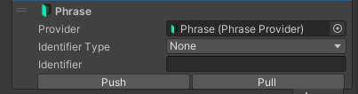
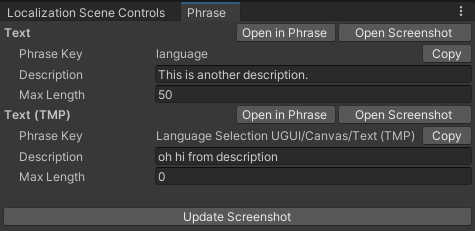

# Unity plugin for Phrase Strings integration

Unity plugin is a package for Unity which allows Unity developers to synchronize their localized strings in Unity with Phrase Strings.

## Setup

Phrase Unity plugin relies on Unity Localization package. It assumes that the Unity developer is using or plans to use localization through Unity Localization, in particular [String Table Collections](https://docs.unity3d.com/Packages/com.unity.localization@1.5/manual/StringTables.html).

In order to get started with Unity Localization, refer to the [guide](https://docs.unity3d.com/Packages/com.unity.localization@1.5/manual/QuickStartGuideWithVariants.html).

After you create initial set of locales and one or more String Table Collections, and connect them with some text objects (and/or start using them programmatically from your Unity scripts), you can install and start using Phrase Plugin, which can be installed in following ways:

* Install from the Asset Store (TBA)
* Install from package archive
  * Assets → Import Package → Custom Package… → choose `.unitypackage` file from disk
* Install from locally checked out source code
  * Either check out the source directly into `YourProject/Packages/com.phrase.plugin` directory, or
  * symlink `unity_plugin` directory into `YourProject/Packages` as `com.phrase.plugin`

Afterwards one should be able to add a Phrase provider asset to their project (Create → Localization → Phrase):

Set up your connection data (environment and auth token [created on Phrase](https://support.phrase.com/hc/en-us/articles/5808341130268-Generate-API-Access-Token-Strings), 1 above) and you will be able to fetch the list of projects and choose one.

The list of locales will be fetched automatically, and if the list of locales in Unity doesn’t match the list on Phrase, you’ll be able to create missing ones on either side (2 above).

You should also connect the string tables that you would like to sync with Phrase by checking them in the list (3 above).

Then you can start by pushing the initial key list to Phrase (usually only the source locale).

After the keys have been translated to target locales, you can pull then back to Unity here.

## Usage

You can perform push/pull from Phrase Provider screen, but also from “Phrase Extension” on the string tables themselves:

There you push/pull only from/to the table in question.

### Working with multiple String Table Collections

It's common that a user might organize their translations into multiple String Table Collections, for example based on the game section or the type of the items referred to (e.g. Weapons, Items, Characters etc). In that case one would want to connect the collection with only a subset of all existing [translation keys](https://support.phrase.com/hc/en-us/articles/5784119185436-Keys-Strings) in Phrase Strings. For this purpose, you can use key name prefixes or [key tags](https://support.phrase.com/hc/en-us/articles/5822598372252-Tags-Strings).

You can constrain the subset of keys that will be pushed/pulled to the particular table, by selecting the “Identifyer Type” in the Collection Extension:

* “Key Prefix” – only keys with the given prefix in their names will be imported (pull) to the target table. The Unity key names will not contain the prefix itself. On push, the whole table will get uploaded to Phrase, and prefix will be automatically appended to the key names.

* “Tag” – only keys with matching tag will be pulled to the target table. Upon pushing, all keys from this table will get this tag assigned.

* “None” – all Phrase keys will be imported to the target table on pull (this is typical when you have only a single Collection connected with Phrase).

### Phrase window

Additionally, you can open (and potentially dock) a “Phrase” editor window, by choosing Window -> Phrase from the menu. This window enables you to easily see keys attached to the text objects from the scene, edit their metadata and upload screenshots:

It shows all the text objects from the selection which are connected to a string table/key (more about that in general Localization Quick Start Guide), shows their assigned key, and enables the user to set their description and maximum character length, which will be synchronized with Phrase upon the next push from the containing String Table.

The user can also open the key in Phrase editor (in external browser tab) by clicking on “Open in Phrase” next to the key name, and copy the key name to the clipboard.

There is also a button for exporting a screenshot (current game view) to Phrase, which will also attach the uploaded screenshot to all listed Phrase keys.

## Contributing

If you want to contribute, check out this project directly into `Packages`
directory of your project and rename the package directory to
`com.phrase.plugin`. You can also create a symlink to it instead.

### Publishing a new release

* Increase version number in `package.json` and `Editor/PhraseClient.cs`
* Update `CHANGELOG.md`
* Publish the release on the Asset Store
